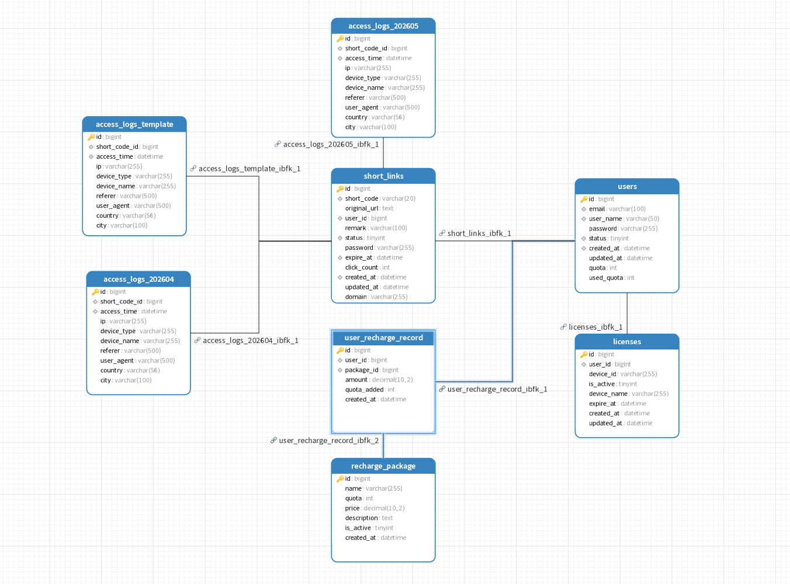

# 短链云（LinkCloud）技术架构文档

## 文档信息

| 项目     | 内容               |
| :------- | :----------------- |
| 文档标题 | 短链云技术架构文档 |
| 项目名称 | 短链云 / LinkCloud |
| 文档版本 | V1.0               |
| 文档状态 | 待评审             |
| 作者     | 黄征、曾志强       |
| 创建时间 | 2026-04-07         |

------

## 1. 技术选型

### 1.1 整体架构图

### 1.2 技术栈明细

| 分层         | 技术                          | 版本      | 说明                          |
| :----------- | :---------------------------- | :-------- | :---------------------------- |
| **前端**     |                               |           |                               |
| 框架         | Flutter                       | 3.x       | 跨平台开发（iOS/Android/Web） |
| 语言         | Dart                          | 3.x       | -                             |
| UI组件库     | Flutter原生 + Material Design | -         | -                             |
| 状态管理     | Riverpod / GetX               | -         | 待确认                        |
| HTTP客户端   | Dio                           | latest    | 待确认                        |
| **后端**     |                               |           |                               |
| 语言         | Go                            | 1.26.1    | 高性能、并发友好              |
| Web框架      | Gin                           | latest    | 轻量、性能好                  |
| 数据库       | MySQL                         | 8.0       | 稳定、关系型数据              |
| 缓存         | Redis                         | 8.0       | 高并发缓存、会话存储          |
| **部署**     |                               |           |                               |
| 反向代理     | Nginx                         | 1.24+     | 负载均衡、HTTPS               |
| 容器化       | Docker                        | -         | 标准化部署                    |
| 云服务器     | 阿里云/腾讯云                 | 2核4G起步 | -                             |
| **开发工具** |                               |           |                               |
| 版本控制     | Git                           | -         | 代码管理                      |

------

## 2. 数据库设计

### 2.1 ER图



### 2.2 users - 用户表

| 字段名     | 类型     | 长度 | 允许空 | 默认值            | 说明               |
| :--------- | :------- | :--- | :----- | :---------------- | :----------------- |
| id         | bigint   | -    | 否     | 自增              | 用户ID，主键       |
| email      | varchar  | 100  | 否     | -                 | 邮箱，登录账号     |
| user_name  | varchar  | 50   | 否     | -                 | 昵称               |
| password   | varchar  | 255  | 否     | -                 | 加密密码（bcrypt） |
| status     | tinyint  | -    | 否     | 1                 | 状态：1正常/0禁用  |
| quota      | int      | -    | 否     | 100               | 配额数量           |
| used_quota | int      | -    | 否     | 0                 | 已使用的配额数量   |
| created_at | datetime | -    | 否     | CURRENT_TIMESTAMP | 创建时间           |
| updated_at | datetime | -    | 否     | CURRENT_TIMESTAMP | 更新时间           |

**索引**：

- `PRIMARY KEY (id)`
- `UNIQUE INDEX uk_email (email)`
- `UNIQUE INDEX uk_user_name (user_name)`
- `INDEX idx_status (status)`
- `INDEX idx_created_at (created_at)`

### 2.3 short_links - 短链接表

| 字段名       | 类型     | 长度 | 允许空 | 默认值            | 说明                       |
| :----------- | :------- | :--- | :----- | :---------------- | :------------------------- |
| id           | bigint   | -    | 否     | 自增              | 主键ID                     |
| short_code   | varchar  | 20   | 否     | -                 | 短码，6位字母数字组合      |
| original_url | text     | -    | 否     | -                 | 原始长链接                 |
| user_id      | bigint   | -    | 否     | -                 | 所属用户ID                 |
| remark       | varchar  | 100  | 是     | NULL              | 备注，方便用户识别         |
| status       | tinyint  | -    | 否     | 1                 | 状态：1启用/0禁用          |
| password     | varchar  | 255  | 是     | NULL              | 密码哈希，NULL表示无密码   |
| expire_at    | datetime | -    | 是     | NULL              | 过期时间，NULL表示永不过期 |
| click_count  | int      | -    | 否     | 0                 | 总点击量                   |
| created_at   | datetime | -    | 否     | CURRENT_TIMESTAMP | 创建时间                   |
| updated_at   | datetime | -    | 否     | CURRENT_TIMESTAMP | 更新时间                   |
| domain       | varchar  | 255  | 否     | 当前服务器域名    | 默认使用当前服务器域名     |

**索引**：

- `PRIMARY KEY (id)`
- `UNIQUE INDEX uk_short_code (short_code)`
- `INDEX idx_user_id (user_id)`
- `INDEX idx_status (status)`
- `INDEX idx_expire_at (expire_at)`
- `INDEX idx_created_at (created_at)`

**关系**：

- 多对一：Users (user_id → users.id)

### 2.4 licenses - 设备授权表

| 字段名      | 类型     | 长度 | 允许空 | 默认值            | 说明         |
| :---------- | :------- | :--- | :----- | :---------------- | :----------- |
| id          | bigint   | -    | 否     | 自增              | 授权ID，主键 |
| user_id     | bigint   | -    | 否     | -                 | 用户ID，外键 |
| device_id   | varchar  | 255  | 否     | -                 | 设备唯一标识 |
| device_name | varchar  | 255  | 否     | -                 | 设备名称     |
| is_active   | tinyint  | -    | 否     | 1                 | 是否激活     |
| expire_at   | datetime | -    | 否     | -                 | 过期时间     |
| created_at  | datetime | -    | 否     | CURRENT_TIMESTAMP | 创建时间     |
| updated_at  | datetime | -    | 否     | CURRENT_TIMESTAMP | 更新时间     |

**索引**：

- `PRIMARY KEY (id)`
- `INDEX idx_user_id (user_id)`

**关系**：

- 多对一：Users (user_id → users.id)

### 2.5 recharge_package - 充值套餐表

| 字段名      | 类型     | 长度   | 允许空 | 默认值            | 说明     |
| :---------- | :------- | :----- | :----- | :---------------- | :------- |
| id          | bigint   | -      | 否     | 自增              | 套餐ID   |
| name        | varchar  | 255    | 否     | -                 | 套餐名称 |
| quota       | int      | -      | 否     | -                 | 配额数量 |
| price       | decimal  | (10,2) | 否     | -                 | 价格     |
| description | text     | -      | 是     | NULL              | 套餐描述 |
| is_active   | tinyint  | -      | 否     | 1                 | 是否上架 |
| created_at  | datetime | -      | 否     | CURRENT_TIMESTAMP | 创建时间 |

**索引**：

- `PRIMARY KEY (id)`

### 2.6 user_recharge_record - 用户充值记录表

| 字段名      | 类型     | 长度   | 允许空 | 默认值            | 说明       |
| :---------- | :------- | :----- | :----- | :---------------- | :--------- |
| id          | bigint   | -      | 否     | 自增              | 记录ID     |
| user_id     | bigint   | -      | 否     | -                 | 用户ID     |
| package_id  | bigint   | -      | 否     | -                 | 套餐ID     |
| amount      | decimal  | (10,2) | 否     | -                 | 充值金额   |
| quota_added | int      | -      | 否     | -                 | 增加的配额 |
| created_at  | datetime | -      | 否     | CURRENT_TIMESTAMP | 充值时间   |

**索引**：

- `PRIMARY KEY (id)`
- `INDEX idx_user_id (user_id)`
- `INDEX idx_package_id (package_id)`

**关系**：

- 多对一：Users (user_id → users.id)
- 多对一：RechargePackage (package_id → recharge_package.id)

------

### 2.7 access_logs - 访问日志表（按月分表）

> 实际表名为 `access_logs_YYYYMM`，如 `access_logs_202604`、`access_logs_202605`。使用模板表 `access_logs_template` 通过存储过程动态创建。

| 字段名        | 类型     | 长度 | 允许空 | 默认值            | 说明                       |
| :------------ | :------- | :--- | :----- | :---------------- | :------------------------- |
| id            | bigint   | -    | 否     | 自增              | 主键ID                     |
| short_code_id | bigint   | -    | 否     | -                 | 短码ID，外键               |
| access_time   | datetime | -    | 否     | CURRENT_TIMESTAMP | 访问时间                   |
| ip            | varchar  | 255  | 是     | NULL              | 访客IP（支持IPv6）         |
| device_type   | varchar  | 255  | 是     | NULL              | 设备类型：PC/Mobile/Tablet |
| device_name   | varchar  | 255  | 是     | NULL              | 设备名称                   |
| referer       | varchar  | 500  | 是     | NULL              | 来源页面                   |
| user_agent    | varchar  | 500  | 是     | NULL              | 浏览器User-Agent           |
| country       | varchar  | 56   | 是     | NULL              | 国家                       |
| city          | varchar  | 100  | 是     | NULL              | 城市                       |

**索引**：

- `PRIMARY KEY (id)`
- `INDEX idx_short_code_id (short_code_id)`
- `INDEX idx_access_time (access_time)`

**关系**：

- 多对一：ShortLinks (short_code_id → short_links.id)

------

### 2.8 存储过程

**create_access_logs_table_for_month - 按月创建分表**

**参数**：

- `table_suffix` VARCHAR(6) - 表后缀，格式为 YYYYMM（如 202604）

**功能**：

- 基于 `access_logs_template` 模板表创建新的分表 `access_logs_{table_suffix}`
- 如果表已存在则不会重复创建

**使用示例**：

```sql
CALL create_access_logs_table_for_month('202607');
```

------

## 3. 接口设计

**Base URL：** `http://{host}:{port}` **协议约定：** 前端所有接口均为 `POST` 方法，请求体 `Content-Type: application/json`，响应体固定 HTTP 200，业务状态通过 `code` 字段区分。

**协议约定：**

- 所有接口统一返回`HTTP 200`
- 请求体使用 `Content-Type: application/json`
- 认证方式：`Authorization: Bearer {token}`

**统一响应格式：**

成功：

```json
{ "code": 0, "message": "ok", "data": { ... } }
```

失败：

```json
{ "code": -N, "message": "错误描述" }
```

### 3.1 发送验证码

```
POST /api/v1/auth/captcha
```

**说明：** 用户注册或忘记密码，发送验证码接口。

**请求体：**

| 字段  | 类型   | 必填 | 说明 |
| ----- | ------ | ---- | ---- |
| email | string | 是   | 邮箱 |

**请求示例：**

```json
{
    "email":"example@qq.com"
}
```

**成功响应：**

```json
{
    "code": 0,
    "message": "验证码已发送到邮箱，请注意查收",
    "data": null
}
```

**错误码：**

| code | 说明                       |
| ---- | -------------------------- |
| -1   | 邮箱不能为空或格式不正确   |
| -2   | 验证码发送失败，请稍后再试 |

### 3.2 用户注册

```
POST /api/v1/auth/register
```

**请求体：**

| 字段      | 类型   | 必填 | 说明               |
| --------- | ------ | ---- | ------------------ |
| email     | string | 是   | 邮箱               |
| user_name | string | 是   | 用户名，长度3-20位 |
| password  | string | 是   | 密码，长度6-20位   |
| captcha   | string | 是   | 验证码，长度为6位  |

**请求示例：**

```json
{
    "email":"example@example.com",
    "user_name":"user_name",
    "password":"password",
    "captcha":"123456"
}
```

**成功响应：**

```json
{
    "code": 0,
    "message": "注册成功",
    "data": {
        "id":1,
        "email":"example@example.com",
        "user_name":"user_name",
        "created_at":1775529463,
        "quota":100,
        "used_quota":0,
        "remaining_quota":100,
        "token":"eyJhbGciOiJIUzI1NiIsInR5cCI6IkpXVCJ9"
    }
}
```

**响应字段说明：**

| 字段            | 类型   | 说明                                      |
| --------------- | ------ | ----------------------------------------- |
| id              | uint64 | 用户ID                                    |
| email           | string | 邮箱                                      |
| user_name       | string | 用户名                                    |
| created_at      | int64  | 注册时间，10位时间戳                      |
| quota           | uint32 | 配额数量                                  |
| used_quota      | uint32 | 已使用的配额的数量                        |
| remaining_quota | uint32 | 剩余的配额的数量                          |
| token           | string | 登录凭证，后续请求通过 Authorization 携带 |

**错误码：**

| code | 说明                              |
| ---- | --------------------------------- |
| -1   | 邮箱/用户名/密码/验证码格式不正确 |
| -2   | 用户名不能为空                    |
| -3   | 邮箱已存在                        |
| -4   | 用户名已存在                      |
| -5   | 验证码已过期，请重新获取          |
| -6   | 验证码不正确                      |

### 3.3 用户登录

```
POST /api/v1/auth/login
```

**请求体：**

| 字段      | 类型   | 必填 | 说明               |
| --------- | ------ | ---- | ------------------ |
| user_name | string | 是   | 用户名，长度3-20位 |
| password  | string | 是   | 密码，长度6-20位   |

**请求示例：**

```json
{
    "user_name": "user_name",
    "password": "123456"
}
```

**成功响应：**

```json
{
    "code": 0,
    "message": "登录成功",
    "data": {
        "id":1,
        "email":"example@example.com",
        "user_name":"user_name",
        "created_at":1775529463,
        "quota":100,
        "used_quota":0,
        "remaining_quota":100,
        "token":"eyJhbGciOiJIUzI1NiIsInR5cCI6IkpXVCJ9"
    }
}
```

**响应字段说明：**

| 字段            | 类型   | 说明                                      |
| --------------- | ------ | ----------------------------------------- |
| id              | uint64 | 用户ID                                    |
| email           | string | 邮箱                                      |
| user_name       | string | 用户名                                    |
| created_at      | int64  | 注册时间，10位时间戳                      |
| quota           | uint32 | 配额数量                                  |
| used_quota      | uint32 | 已使用的配额的数量                        |
| remaining_quota | uint32 | 剩余的配额的数量                          |
| token           | string | 登录凭证，后续请求通过 Authorization 携带 |

**错误码：**

| code | 说明                           |
| ---- | ------------------------------ |
| -1   | 用户名不能为空                 |
| -2   | 密码不能为空                   |
| -3   | 用户不存在                     |
| -4   | 用户名或密码错误               |
| -5   | 多次登录失败，请15分钟后再尝试 |

### 3.4 生成短链接

```
POST /api/v1/links
```

**说明：**为用户生成一个新的短链接。

**请求头**：

| 字段          | 值               | 必填 | 说明          |
| :------------ | :--------------- | :--- | :------------ |
| Authorization | Bearer {token}   | 是   | 用户认证Token |
| Content-Type  | application/json | 是   | 请求体格式    |

**请求体**：

| 字段         | 类型   | 必填 | 说明                               |
| :----------- | :----- | :--- | :--------------------------------- |
| original_url | string | 是   | 原始长链接                         |
| remark       | string | 否   | 备注，方便用户识别                 |
| password     | string | 否   | 访问密码，非空则短链接需要密码访问 |
| expire_at    | int64  | 否   | 过期时间戳（10位），不传则永不过期 |
| domain       | string | 是   | 域名                               |

**请求示例**：

```json
{
    "original_url": "https://www.example.com/very/long/url",
    "remark": "我的博客",
    "password": "123456",
    "expire_at": 1775532006,
    "domain":"example"
}
```

**成功响应**：

```json
{
    "code": 0,
    "message": "生成成功",
    "data": {
        "id": 1,
        "short_code": "abc123",
        "short_url": "https://s.linkcloud.com/abc123",
        "original_url": "https://www.example.com/very/long/url",
        "remark": "我的博客",
        "status": 1,
        "has_password": true,
        "expire_at": 1775532006,
        "click_count": 0,
        "created_at": 1775529463,
        "updated_at": 1775529463
    }
}
```

**响应字段说明**：

| 字段         | 类型   | 说明                         |
| :----------- | :----- | :--------------------------- |
| id           | uint64 | 短链接ID                     |
| short_code   | string | 6位数字或字母组合的短码      |
| short_url    | string | 完整短链接地址               |
| original_url | string | 原始长链接                   |
| remark       | string | 备注                         |
| status       | uint8  | 状态：1启用/0禁用            |
| has_password | bool   | 是否需要密码访问             |
| expire_at    | int64  | 过期时间戳，null表示永不过期 |
| click_count  | uint32 | 总点击量                     |
| created_at   | int64  | 创建时间戳                   |
| updated_at   | int64  | 更新时间戳                   |

**错误码**：

| code | 说明                 |
| :--- | :------------------- |
| -1   | 长链接不能为空       |
| -2   | 长链接格式不正确     |
| -3   | 配额不足，请充值     |
| -4   | 短码生成失败，请重试 |

### 3.5 短链接跳转

```
GET /{short_code}
```

**说明**：访问短链接，重定向到原始长链接。无需认证，但支持密码访问。

**请求参数：**

| 参数       | 类型   | 必填 | 说明 |
| :--------- | :----- | :--- | :--- |
| short_code | string | 是   | 短码 |

**请求示例**：

```
GET /abc123
```

**成功响应（无需密码）**：

```
HTTP/1.1 302 Found
Location: https://www.example.com/very/long/url
```

**需要密码时（返回密码表单）**：

```json
{
    "code": -1,
    "message": "该短链接需要密码访问",
    "data": {
        "short_code": "abc123",
        "need_password": true
    }
}
```

**验证密码请求**：

```
GET /{short_code}?password={password}
```

**验证密码成功响应**：

```
HTTP/1.1 302 Found
Location: https://www.example.com/very/long/url
```

**验证密码失败响应**：

```
{
    "code": -2,
    "message": "密码错误，还剩4次机会"
}
```

**错误码**：

| code | 说明           |
| :--- | :------------- |
| -1   | 短链接不存在   |
| -2   | 短链接已过期   |
| -3   | 短链接已被禁用 |
| -4   | 密码不能为空   |
| -5   | 需要密码访问   |
| -6   | 密码错误       |

### **3.6 获取短链接列表**

```
GET /api/v1/links
```

**说明**：分页获取当前用户的短链接列表。

**请求头**：

| 字段          | 值             | 必填 | 说明          |
| :------------ | :------------- | :--- | :------------ |
| Authorization | Bearer {token} | 是   | 用户认证Token |

**请求参数：**

| 参数     | 类型   | 必填 | 默认值 | 说明                    |
| :------- | :----- | :--- | :----- | :---------------------- |
| page     | int    | 否   | 1      | 页码（从1开始）         |
| size     | int    | 否   | 20     | 每页数量                |
| status   | int    | 否   | -      | 状态筛选：1启用/0禁用   |
| keyword  | string | 否   | -      | 关键词搜索（备注/短码） |
| sort_dir | string | 否   | Desc   | 排序方向，升序/降序     |

**请求示例**：

```
GET /api/v1/links?page=1&size=10&status=1&keyword=博客&sort_dir=Desc
```

**成功响应**：

```json
{
    "code": 0,
    "message": "ok",
    "data": {
        "total": 50,
        "page": 1,
        "size": 10,
        "list": [
            {
                "id": 1,
                "short_code": "abc123",
                "short_url": "https://s.linkcloud.com/abc123",
                "original_url": "https://www.example.com/blog/1",
                "remark": "我的博客",
                "status": 1,
                "has_password": false,
                "expire_at": 0,
                "click_count": 128,
                "created_at": 1775529463,
                "updated_at": 1775529463
            }
        ]
    }
}
```

**错误码**：

| code | 说明              |
| :--- | :---------------- |
| -1   | 请求页不能为0     |
| -2   | 请求页大小不能为0 |

------

### 3.7 获取短链接详情

```
GET /api/v1/links/{short_code}
```

**说明**：获取指定短链接的详细信息。

**请求头**：

| 字段          | 值             | 必填 | 说明          |
| :------------ | :------------- | :--- | :------------ |
| Authorization | Bearer {token} | 是   | 用户认证Token |

**请求参数：**

| 参数       | 类型   | 必填 | 说明 |
| :--------- | :----- | :--- | :--- |
| short_code | string | 是   | 短码 |

**成功响应**：

```json
{
    "code": 0,
    "message": "ok",
    "data": {
        "id": 1,
        "short_code": "abc123",
        "short_url": "https://s.linkcloud.com/abc123",
        "original_url": "https://www.example.com/very/long/url",
        "remark": "我的博客",
        "status": 1,
        "has_password": true,
        "expire_at": 1776124800,
        "click_count": 128,
        "created_at": 1775529463,
        "updated_at": 1775529463
    }
}
```

**错误码**：

| code | 说明         |
| :--- | :----------- |
| -1   | 短链接不存在 |

### 3.8 修改短链接

```
PATCH /api/v1/links/{short_code}
```

**说明**：修改短链接信息。

**请求头**：

| 字段          | 值             | 必填 | 说明          |
| :------------ | :------------- | :--- | :------------ |
| Authorization | Bearer {token} | 是   | 用户认证Token |

**请求参数：**

| 参数       | 类型   | 必填 | 说明 |
| :--------- | :----- | :--- | :--- |
| short_code | string | 是   | 短码 |

**请求体**：

| 字段         | 类型   | 必填 | 说明                                                 |
| :----------- | :----- | :--- | :--------------------------------------------------- |
| original_url | string | 否   | 原始长链接，传 null 表示不修改                       |
| remark       | string | 否   | 备注，传 null 表示不修改                             |
| password     | string | 否   | 访问密码（空字符串表示清除密码），传 null 表示不修改 |
| expire_at    | int64  | 否   | 过期时间戳，传 null 表示不设置或清除过期时间         |
| status       | int    | 否   | 状态：1启用/0禁用                                    |

**请求示例**：

```json
{
    "remark": "我的新博客",
    "expire_at": 1776124800
}
```

**成功响应**：

```json
{
    "code": 0,
    "message": "修改成功",
    "data": null
}
```

**错误码**：

| code | 说明             |
| :--- | :--------------- |
| -1   | 短链接不存在     |
| -2   | 长链接格式不正确 |

### 3.9 删除短链接

```
DELETE /api/v1/links/{short_code}
```

**说明**：软删除短链接。

**请求头**：

| 字段          | 值             | 必填 | 说明          |
| :------------ | :------------- | :--- | :------------ |
| Authorization | Bearer {token} | 是   | 用户认证Token |

**请求参数：**

| 参数       | 类型   | 必填 | 说明 |
| :--------- | :----- | :--- | :--- |
| short_code | string | 是   | 短码 |

**成功响应**：

```json
{
    "code": 0,
    "message": "删除成功",
    "data": null
}
```

**错误码**：

| code | 说明         |
| :--- | :----------- |
| -1   | 短链接不存在 |
| -2   | 删除失败     |

### 3.10 获取短链接统计数据

```
GET /api/v1/stats/{short_code}
```

**说明**：获取短链接的访问统计数据。

**请求头**：

| 字段          | 值             | 必填 | 说明          |
| :------------ | :------------- | :--- | :------------ |
| Authorization | Bearer {token} | 是   | 用户认证Token |

**请求参数：**

| 参数       | 类型   | 必填 | 说明 |
| :--------- | :----- | :--- | :--- |
| short_code | string | 是   | 短码 |

**请求参数：**

| 参数 | 类型  | 必填 | 默认值 | 说明                  |
| :--- | :---- | :--- | :----- | :-------------------- |
| days | int32 | 否   | 7      | 统计最近N天，最大90天 |

**成功响应**：

```json
{
    "code": 0,
    "message": "ok",
    "data": {
        "total_clicks": 1024,
        "unique_visitors": 512,
        "daily_clicks": [
            {"date": "2026-04-01", "count": 120},
            {"date": "2026-04-02", "count": 150},
            {"date": "2026-04-03", "count": 98}
        ],
        "device_stats": [
            {"device_type": "PC", "count": 600},
            {"device_type": "Mobile", "count": 400},
            {"device_type": "Tablet", "count": 24}
        ],
        "countries": [
            {"country": "中国", "count": 800},
            {"country": "美国", "count": 150},
            {"country": "日本", "count": 74}
        ],
        "referers": [
            {"referer": "https://www.google.com", "count": 300},
            {"referer": "https://www.baidu.com", "count": 200}
        ]
    }
}
```

**错误码**：

| code | 说明         |
| :--- | :----------- |
| -1   | 短链接不存在 |

### 3.11 获取短链接访问记录

```
GET /api/v1/stats/{short_code}/logs
```

**说明**：分页获取短链接的详细访问记录。

**请求头**：

| 字段          | 值             | 必填 | 说明          |
| :------------ | :------------- | :--- | :------------ |
| Authorization | Bearer {token} | 是   | 用户认证Token |

**请求参数：**

| 参数       | 类型   | 必填 | 说明 |
| :--------- | :----- | :--- | :--- |
| short_code | string | 是   | 短码 |

**请求参数：**

| 参数     | 类型  | 必填 | 默认值 | 说明                           |
| :------- | :---- | :--- | :----- | :----------------------------- |
| page     | int   | 否   | 1      | 页码（从1开始）                |
| size     | int   | 否   | 20     | 每页数量                       |
| start_at | int64 | 否   | -      | 开始时间戳，不传则返回全部记录 |
| end_at   | int64 | 否   | -      | 结束时间戳，不传则返回全部记录 |

**成功响应**：

```json
{
    "code": 0,
    "message": "ok",
    "data": {
        "total": 1024,
        "page": 1,
        "size": 20,
        "list": [
            {
                "access_time": 1775529463,
                "ip": "192.168.1.1",
                "country": "中国",
                "city": "深圳",
                "device_type": "Mobile",
                "device_name": "iPhone 14",
                "referer": "https://www.google.com",
                "user_agent": "Mozilla/5.0..."
            }
        ]
    }
}
```

**错误码**：

| code | 说明         |
| :--- | :----------- |
| -1   | 短链接不存在 |

### 3.12 获取用户信息

```
GET /api/v1/user/info
```

**说明**：获取当前登录用户的详细信息。

**请求头**：

| 字段          | 值             | 必填 | 说明          |
| :------------ | :------------- | :--- | :------------ |
| Authorization | Bearer {token} | 是   | 用户认证Token |

**成功响应**：

```json
{
    "code": 0,
    "message": "ok",
    "data": {
        "id": 1,
        "email": "example@example.com",
        "user_name": "user_name",
        "status": 1,
        "quota": 100,
        "used_quota": 25,
        "remaining_quota": 75,
        "created_at": 1775529463,
        "updated_at": 1775529463
    }
}
```

### 3.13 修改用户信息

```
PATCH /api/v1/user/info
```

**说明**：修改当前登录用户的用户名或密码。修改成功后，旧 Token 立即失效，需要使用返回的新 Token 进行后续请求。如果不更新任何字段，前端应做拦截。

**请求头**：

| 字段          | 值             | 必填 | 说明          |
| :------------ | :------------- | :--- | :------------ |
| Authorization | Bearer {token} | 是   | 用户认证Token |

**请求体**：

| 字段         | 类型   | 必填 | 说明     |
| :----------- | :----- | :--- | :------- |
| user_name    | string | 否   | 新用户名 |
| old_password | string | 否   | 旧密码   |
| new_password | string | 否   | 新密码   |

**请求示例**：

```json
// 只修改用户名
{
    "user_name": "新用户名"
}
```

```json
// 只修改密码
{
    "old_password": "old123456",
    "new_password": "new123456"
}
```

```json
// 同时修改用户名和密码
{
    "user_name": "新用户名",
    "old_password": "old123456",
    "new_password": "new123456"
}
```

**成功响应**：

```json
{
    "code": 0,
    "message": "修改成功, 请重新登录",
    "data": null
}
```

**错误码**：

| code | 说明                     |
| :--- | :----------------------- |
| -1   | 用户不存在               |
| -2   | 用户名和密码不能同时为空 |
| -3   | 用户名已存在             |
| -4   | 旧密码错误               |
| -5   | 旧密码和新密码不能相同   |

### 3.14 退出登录

```
POST /api/v1/auth/logout
```

**说明**：退出登录，客户端丢弃 Token 即可，服务端可选择将 Token 加入黑名单。

**请求头**：

| 字段          | 值             | 必填 | 说明          |
| :------------ | :------------- | :--- | :------------ |
| Authorization | Bearer {token} | 是   | 用户认证Token |

**成功响应**：

```json
{
    "code": 0,
    "message": "退出成功",
    "data": null
}
```

## 4. 缓存策略

### 4.1 Redis 数据结构

| Key 格式                     | 类型   | TTL    | 说明           |
| :--------------------------- | :----- | :----- | :------------- |
| `link:{short_code}`          | Hash   | 1小时  | 短链接信息缓存 |
| `captcha:{email}`            | String | 5分钟  | 验证码         |
| `token:{user_id}`            | String | 24小时 | 用户Token      |
| `rate:password:{short_code}` | String | 5分钟  | 密码错误锁定   |

### 4.2 缓存读写策略

| 操作 | 策略                             |
| :--- | :------------------------------- |
| 查询 | 先读缓存，未命中读数据库，写缓存 |
| 更新 | 更新数据库，删除缓存             |
| 删除 | 删除数据库，删除缓存             |

------

## 5. 安全设计

### 5.1 安全措施

| 措施        | 说明                  |
| :---------- | :-------------------- |
| 密码加密    | bcrypt（cost=10）     |
| JWT Token   | 签名验证，有效期控制  |
| 限流        | IP限流（10次/秒）     |
| 防暴力破解  | 密码错误5次锁定15分钟 |
| XSS防护     | 输出转义              |
| SQL注入防护 | 参数化查询            |

### 5.2 限流策略

| 场景             | 限制       | 处理             |
| :--------------- | :--------- | :--------------- |
| 同一IP请求       | 10次/秒    | 返回429，等待1秒 |
| 同一账号密码错误 | 5次/15分钟 | 锁定15分钟       |
| 同一短码密码错误 | 5次/5分钟  | 锁定5分钟        |

------

## 6. 版本记录

| 版本 | 日期       | 作者 | 修改内容 |
| :--- | :--------- | :--- | :------- |
| V1.0 | 2026-04-07 | -    | 初稿     |